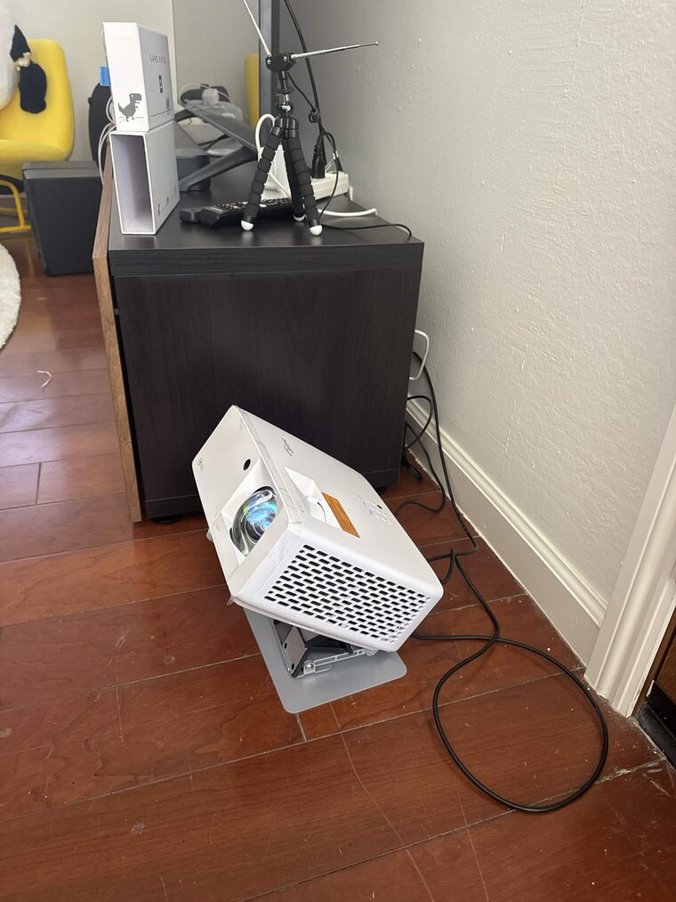

<h1 align="center">Skylight</h1>

<p align="center">
  <em>Project the aircraft passing overhead onto your ceiling, in real time — an X-ray through the roof.</em>
</p>

<p align="center">
  <a href="https://skylightceiling.com"><b>🛰️ Get notified when I launch on a crowdfunding platform → skylightceiling.com</b></a>
  <br><sub>A ready-made kit is coming. Join the waitlist for early access &amp; launch pricing.</sub>
</p>

<p align="center">
  
</p>

<p align="center">


https://github.com/user-attachments/assets/9256b0eb-cc27-4388-9a4f-0a6c05468304


</p>

Skylight decodes ADS-B from a cheap RTL-SDR radio and renders the planes physically
flying over you onto a ceiling-pointed projector. A jet you'd hear overhead glides
across your ceiling at the same moment — labeled with its airline, type, and where it's
headed. Pure-black background so the projector's rectangle disappears and only the
aircraft (and stars) are lit.

It also draws the **real sky** behind the planes — sun, moon, bright stars and
constellations, and live **satellites including the ISS** — all at their true positions
for your location and time. Tune everything from your phone.

> Reference build is centered on **San Francisco International (SFO)**, but it works
> anywhere — set your coordinates (and swap the runway data) and you're flying.

## Features

- **Real-time overhead aircraft** from a local RTL-SDR (sub-second), or from a free web
  API with zero code changes — handy for trying it with no radio.
- **Type-aware glyphs** in a luminous, swept-wing style: widebodies tower over regional
  jets, **helicopters spin their rotors**, turboprops and GA aircraft spin their props.
- **Smooth motion** — interpolates the ~1 Hz fixes to 60 fps by rendering slightly in
  the past and tweening between real positions (no teleporting).
- **Comet trails**, altitude-graded color, and range rings + compass for orientation.
- **Rare-aircraft glow** — A380s, 747s, heavies, and big military transports get a warm
  pulsing ring so you don't miss the good ones.
- **Pick any airport from your phone** — search 2,800+ scheduled airports by name / IATA /
  ICAO, jump to the ones **busiest right now** (ranked by live traffic), or auto-cycle
  through them on a timer with **airport tour** mode. Runways + an airport plaque (name and
  a Wikipedia photo) are drawn at their true position.
- **Window to elsewhere** — each routed flight shows its destination **city, local time
  there, and miles-to-go**, a faint great-circle arc toward where it's headed, and an
  optional slow **ticker** of where everything overhead is going.
- **Live sky layer** — sun, moon (with phase), bright stars + constellation lines, and
  **satellites / ISS** computed from TLEs. Scrub time forward/back from your phone, or
  jump straight to the next ISS pass. Plus **meteor-shower radiants** during active showers,
  an optional sun-driven **day/night tint**, and a live **weather** readout.
- **Phone control panel** — every setting (rotation, theme, palette, filters, sky
  toggles, …) is live-tunable over your LAN and persists across reboots. Save named
  **scenes**, and watch a **live preview** of the ceiling while you calibrate.
- **Appliance-ready** — boots straight to a full-screen kiosk on a Raspberry Pi 5.

## Hardware

| Part | Suggested | Notes |
|---|---|---|
| Receiver | **RTL-SDR Blog V4 + dipole** | The included dipole is plenty — planes are nearly overhead. |
| Compute | **Raspberry Pi 5 (8 GB)** | Decode + render. Active cooling for 24/7. |
| Projector | A 1080p projector pointed up | Laser (e.g. Optoma GT2100HDR) gives the deepest blacks, but it's overkill — see the budget tip below. |
| Display link | micro-HDMI → HDMI | The Pi 5 uses **micro**-HDMI (not mini). |
| Mount | Rotating 1/4-20 stand, pointed up | Lower the stand for a bigger image; tape **+ a safety tether**. |

> **💡 Budget tip — you don't need an expensive projector.** The pricey laser short-throw
> is only worth it if you want the image visible in a **lit** room. If you're happy viewing
> it in a **dim/dark** room (the intended vibe), a cheap **native-1080p LED** projector like
> the **[Yaber Buffalo Pro U9](https://www.projectorcentral.com/Yaber-Pro_U9.htm) (~$150)**
> works great:
> - **No short-throw needed** — from the floor under an ~8 ft ceiling, even a 1.35:1 throw
>   gives a ~5.5 ft image.
> - **Low brightness is fine** (even better) — the content is sparse-on-black, so 200–400
>   lumens in a dark room actually looks *deeper*.
> - Just verify it's **native 1920×1080** (not "1080p supported"), has a **quiet fan**, and
>   an **HDMI input that shows on power-on**.

<p align="center">
  
  <br><em>The build — short-throw projector pointing up, RTL-SDR dipole on the cabinet.</em>
</p>

You don't need any of this to try it — see Quick start.

## Quick start (local, no radio)

Runs entirely on your computer against a free public ADS-B API.

```bash
pnpm install
DATA_SOURCE=api pnpm dev
```

- **Display:** http://localhost:5173/
- **Control panel:** http://localhost:5173/control.html (or from your phone: `http://<your-ip>:5173/control.html`)

Set your location right in the control panel: search for an airport, tap **Use my
position**, or browse the airports **busiest right now**. Runways load on demand, so any
scheduled airport works out of the box (defaults to SFO).

### With a radio (locally)

```bash
scripts/install-rtlsdr-fedora.sh    # rtl-sdr-blog driver + blacklist DVB-T (Fedora; see script for Debian)
scripts/run-dump1090-local.sh       # decode + serve aircraft.json on :8080
DATA_SOURCE=radio pnpm dev
```

## Raspberry Pi appliance

Full walkthrough in [`pi-setup/README.md`](pi-setup/README.md): flash + headless
provision the SD card, install the driver + decoder + app, and set up the boot-to-kiosk
display. Once it's running, push updates from your dev machine with:

```bash
PI_HOST=skylight.local ./scripts/deploy-to-pi.sh
```

## Configuration

`Config` ([`shared/src/config.ts`](shared/src/config.ts)) is the single source of truth,
persisted to `server/data/config.json` and live-editable from the control panel. Key
fields:

| | |
|---|---|
| `airportIcao` / `centerLat` / `centerLon` | **Your location** — set via the airport picker or "Use my position". |
| `radiusMiles` | How far out to show (default 3 — "what you could realistically see"). |
| `autoZoomAirport` | Auto-fit the zoom so the airport's runways fill the screen (always on during the airport tour). |
| `glyphStyle` | Draw aircraft as `filled` silhouettes, per-part `outline`s, or a single `contour` outline (clearer over busy maps). |
| `rotationDeg` / `mirrorX` | Calibration for the looking-up flip (tune against a real pass). |
| `theme` | `ambient` · `telemetry` · `focus`. |
| `highlightRare` | Glow rare/iconic aircraft (A380, 747, heavies, military). |
| `airportTour` / `airportTourIntervalSec` | Auto-cycle the busiest airports (default every 10 s). |
| `showStars` / `showSun` / `showMoon` / `showSatellites` | Sky layer toggles. |
| `showMeteorShowers` / `dayNightTint` / `showWeather` | Sky extras (radiants, sun-driven tint, live weather). |
| `skyTimeOffsetMin` | Scrub the sky clock for testing (0 = live). |
| `showDestArc` / `showRouteDetail` / `showDestTicker` | "Window to elsewhere". |

**Using it somewhere other than SFO:** just pick your airport (or "Use my position") in
the control panel — runway geometry is fetched on demand from
[OurAirports](https://ourairports.com/data/) and the sky is computed for your coordinates
automatically. Saved as `airportIcao` + `centerLat`/`centerLon` in the config.

Scenes are saved separately to `server/data/presets.json`.

### Server environment

| Env | Default | Meaning |
|---|---|---|
| `DATA_SOURCE` | `radio` | `radio` (dump1090) or `api` (airplanes.live) |
| `AIRCRAFT_JSON_URL` | `http://localhost:8080/aircraft.json` | dump1090 feed |
| `SUPPLEMENT_API` | `1` | When on radio, merge the API too (keeps landing aircraft alive) |
| `PORT` / `HOST` | `3000` / `0.0.0.0` | HTTP + WebSocket |

## Architecture

```
RTL-SDR ──USB──> dump1090-fa ──> aircraft.json (:8080)
                                      │ poll ~1 Hz  (+ API supplement)
                                      ▼
                         server/  (Node · Express · ws)
                         • normalize + enrich (airline/type tables + adsbdb routes)
                         • proxy satellite TLEs (Celestrak)
                         • persist config, broadcast over WebSocket
                         ├──────────────────────┬───────────────────────┐
                         ▼                      ▼                       ▼
                   Display (/)            Control (/control)        REST /api/*
                   canvas renderer +      phone settings UI
                   sky engine → projector (live, two-way)
```

- **`shared/`** — TypeScript types, config schema, and pure geo/projection math.
- **`server/`** — polls the radio (primary) and API (supplement), enriches aircraft,
  proxies TLEs, persists config, and pushes everything over a WebSocket.
- **`web/`** — Vite + React, two pages: the **display** (`<canvas>` renderer + celestial
  engine) and the mobile **control panel**.

**Stack:** TypeScript · React · Vite · Express · ws · pnpm workspaces ·
[astronomy-engine](https://github.com/cosinekitty/astronomy) ·
[satellite.js](https://github.com/shashwatak/satellite-js).

## Credits & data

- ADS-B decode: [dump1090-fa](https://github.com/flightaware/dump1090) · RTL-SDR Blog
  [drivers](https://github.com/rtlsdrblog/rtl-sdr-blog)
- Routes / aircraft enrichment: [adsbdb](https://www.adsbdb.com/) ·
  fallback feed + live airport traffic: [airplanes.live](https://airplanes.live/)
- Satellite elements: [Celestrak](https://celestrak.org/) · airport data + photos:
  [OurAirports](https://ourairports.com/) + [Wikipedia](https://www.wikipedia.org/)
- Weather: [Open-Meteo](https://open-meteo.com/)

## License

[MIT](LICENSE) — be excellent, point it at the sky.
